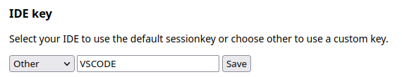
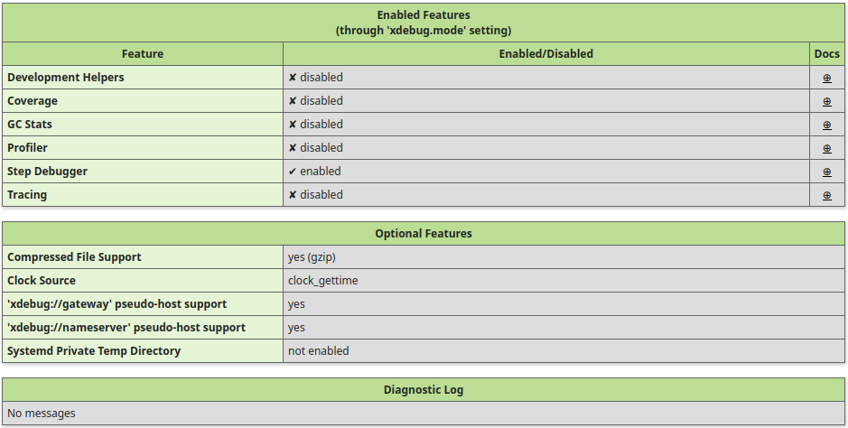

# Configurando Xdebug em conatainers Docker

Realizar debugs em código PHP pode ser uma tarefa ardua muitas vezes, mas ferramentas como o [Xdebug](https://xdebug.org) podem tornar esse trabalho mais fácil uma vez que permite realizar o monitoramento da aplicação durante o desenvolvimento diminuindo a propagação de erros para a produção.

## Indice

- [DockerFile e docker-compose](#dockerfile-e-docker-compose)
- [VsCode](#vscode)
- [Logs](#logs)

# DockerFile e docker-compose
 Inicialmente é importante entender a nossa estrutura dentro do diretório **.docker**, nele temos os arquivos e configuração do servidor web(NGIN-X), banco de dados(MySQL) e do PHP. Esses arquivos serão copiados para dentro dos containers da aplicação.
 ## PHP
 Aqui temos a configuração necessária para habilitar o Xdebug no container.

 ```PHP
    [xdebug]
    ; zend_extension=/usr/local/lib/php/extensions/no-debug-non-zts-20210902/xdebug.so //instala a extensão caso o docker não funcione
    xdebug.mode=debug // modo de execusão do xdebug
    xdebug.start_with_request=trigger // faz o rastreamento de função, depuração e coleta de estatísticas de lixo. 
    xdebug.idekey=VSCODE // id para identificar nossa aplicação   
    xdebug.client_host=host.docker.internal // conecta nosso host ao host do docker
    xdebug.log=/var/www/storage/logs/xdebug.log // salva os logs durante a execução 
    xdebug.client_port=9003 // porta usada para transmissão das informações 
 ```
 Como o parâmetro ***xdebug.start_with_request*** está como trigger ela precisa da extensão [Xdebug helper](https://chrome.google.com/webstore/detail/xdebug-helper/eadndfjplgieldjbigjakmdgkmoaaaoc) no navegador para que toda Url acessada dispare o monitoramento do xdebug. Também é necessário configurar no Xdebug helper uma chave que identifica a IDE que estamos utilizando. Ao selecionar as ___preferências___  sua chave deve ser a mesma que está escrita em ***xdebug.idekey*** você encontrará a seguinte imagem.

 
      
# VsCode
Agora no VScode precisamos habilitar a extensão [PHP Xdebug](https://marketplace.visualstudio.com/items?itemName=xdebug.php-debug) quando for executada pela primeira vez ela irá criar um diretório de nome **.vscode** e dentro dele um arquivo de nome ***launch.json*** é neste arquivo que é dado o caminho das pedras para o vscode acessar as informações/logs gerados pelo Xdebug

```JSON
"configurations": [

   {
      "name": "Listen for Xdebug",
      "type":"php",
      "request": "launch",
      "hostname": "0.0.0.0", //aqui temos a garantia de estamos acessando o docker da aplicação
      "log": true,
      "port": 9003, // a mesma definida no xdebug.client_port
      "pathMappings": {
            "/var/www" : "${workspaceFolder}" //rota onde nosso projeto se encontra dentro do container  
            
      },
      "xdebugSettings": {
            "max_children": 10000,
            "max_data": 10000,
            "show_hidden": 1
      }
   }
]
```
Con toda essa estrutura montada agora temos que testar se nossa configuração funciona, para isso criamos um diretório de nome **public** com um arquivo ***index.php e dentro dele o seguinte código.

```PHP
 phpinfo();exit; 
```
Ao rodar seu projeto no local você terá todas as informações sobre o comportamento do xdebug como mostrado na imagem a seguir.



Se nenhuma mensagem de erro dentro de diagnostic log for apresentada então sua configuração de completa e agora pode se garantir debugando seu projeto.

# Logs

Criamos também diretórios de nome **storage/logs** somente com o objetivo de armazenar todos os logs criados pelo xdebug durante o processo de debug.

# Algumas referências
 - [XDebug e Docker - Configurar PHPStorm e VSCode para funcionar com XDebug usando Docker](https://www.youtube.com/watch?v=kbq3FJOYmQ0&list=LL&index=7&t=788s)
 - [Xdebug 3, Docker, Laravel, VScode](https://dev.to/getjv/xdebug-3-docker-laravel-vscode-52bi)  